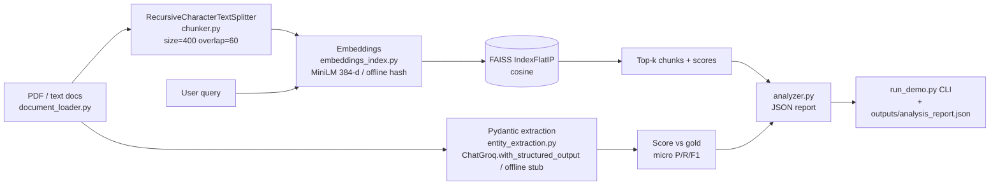

# Document Analyzer — Architecture (Day 21)

One integrated pipeline that consolidates the Week 3 building blocks
(Day 17 embeddings/semantic search, Day 18 chunking, Day 20 Pydantic
structured extraction) into a single importable, PEP8 package.

## System diagram

## Components (one concern each)

- **document_loader.py** — Loads `.txt`/`.pdf` to plain text
  (`PyPDFLoader` with a `pypdf` fallback) and auto-creates the sample
  corpus (text files + one real PDF written by a tiny, dependency-free
  PDF writer). Each sample ships with known gold entities, and one
  document holds the answer to the test query.
- **chunker.py** — `RecursiveCharacterTextSplitter` with a chunk
  size/overlap tuned to *this* corpus (400/60), plus `tune_chunk_size`
  which sweeps candidate sizes and reports top-1 retrieval quality.
- **embeddings_index.py** — One embedder interface with two backends:
  the real `all-MiniLM-L6-v2` (384-d, local, via `HuggingFaceEmbeddings`)
  and a deterministic offline hashed bag-of-words stand-in. Both feed a
  **real** `faiss.IndexFlatIP` over L2-normalized vectors, so inner
  product equals cosine similarity.
- **entity_extraction.py** — Pydantic v2 `DocumentEntities` model with a
  regex email `@field_validator`. Live extraction uses
  `ChatGroq(...).with_structured_output(DocumentEntities)`; the offline
  stub returns valid objects with deliberately injected errors so the
  accuracy metric is non-trivial. Includes micro P/R/F1 scoring vs gold.
- **analyzer.py** — Orchestrates load → chunk → index → search →
  extract → score → JSON report, and verifies a JSON reload round-trip.
- **run_demo.py** — CLI entry point; `--live` toggles the real stack.
- **verify_pipeline.py** — Six offline assertions proving the wiring.

## Design choices (and trade-offs)

- **Cosine via normalized inner product.** `IndexFlatIP` on unit vectors
  is exact and simple; fine at this corpus size. At scale, swap to an
  ANN index (`IndexIVFFlat`/HNSW) — faster, approximate.
- **Chunk size 400/60.** All swept sizes retrieved correctly; smaller
  chunks scored higher (256 → 0.65 vs 512 → 0.44) but fragment more.
  400 balances retrieval precision against fragment count and the risk
  of splitting a fact across a boundary.
- **MiniLM (384-d).** Small, fast, local, no API. Trade-off: weaker on
  long or highly domain-specific text than a larger encoder.
- **Offline gating.** Keeps the pipeline runnable/testable with no model
  download or API key, while the real code path stays a one-flag switch.

## Path to production (Week 4)

Move FAISS-local → a managed vector DB (Pinecone), add metadata
filtering and chunk metadata enrichment, build an evaluation set so
retrieval and extraction stay measurable, and wrap the flow in a proper
RAG pipeline with caching and monitoring.
